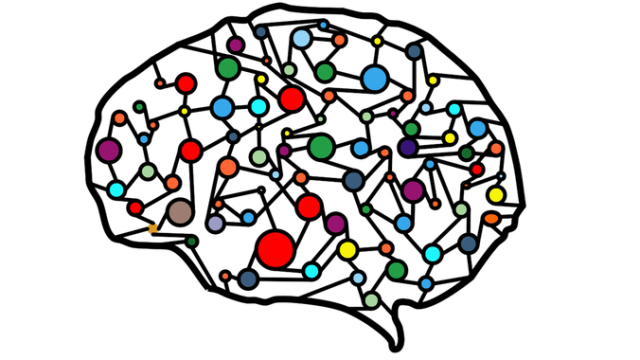

# AnalogNeuronTrainer
Tercera práctica de la asignatura de Computación neuronal y evolutiva
Entregada por Adrián Pérez García el dia 13/05/2021  

  

 Se implementa el entrenamiento de una neurona analógica contra un dataset normalizado sobre el tipo de iris segun cuatro variables extraido de <a href="https://sci2s.ugr.es/keel/category.php?cat=clas">KEEL</a> con las siguientes personalizaciones:

-   Configurables errores medios aceptables en el aprendizaje (Tanto para el conjunto de entrenamiento como para el de de validación).

-   Configurables tiempos máximos (número de iteraciones) del algoritmo de aprendizaje y del sub-algoritmo del entrenamiento.

-   Personalizable el parametro de aprendizaje Alpha (α).

-   Configurables los exponentes del cálculo del potencial.

-   Posibilidad, mediante la variable debug, de ver detalladamente los cambios en los pesos para cada iteración en el entrenamiento.

-   Personalización de cálculo de la función y(k) entre función identidad, seno, sigmoidal o gaussiana.

## Uso

Todos los parametros previamente mencionados se pueden modificar mediante el fichero <a href="params.properties">params.properties</a> exceptuando la función de cálculo de y(k) y el debug las cuales se modifican en el fichero <a href="src/com/apereg/cn/Main.java">Main.java</a>

## Tecnologías

Se ha utilizado Java como único lenguaje de programación usando como kit de desarrollo JDK 15.

##

  
  
  

