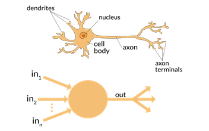

  
  
  

# AnalogNeuronTrainer
Tercera práctica de la asignatura de Computación neuronal y evolutiva
Entregada por Adrián Pérez García el dia 13/05/2021

  

Se implementa el entrenamiento de una neurona analógica sobre un dataset personalizado obtenido como la normalización de un conjunto de datos sobre el tipo de iris segun cuatro variables.

-   Personalización de errores aceptables en el aprendizaje (Tanto para el conjunto de entrenamiento como para el de de validación).

-   Personalización de tiempos máximos de iteraciones de aprendizaje y entrenamiendo.

-   Personalización del parametro de aprendizaje alpha

-   Personalización de lo de la r

-   Posibilidad, mediante la variable debug, de ver detalladamente los cambios en los pesos para cada iteración en el entrenamiento.

-   Personalización de cálculo de la función y(k) entre función identidad, seno, sigmoidal o gaussiana.

  

## Uso

Todos los parametros previamente mencionados se pueden modificar mediante el fichero <a href="params.properties">params.properties</a> exceptuando la función de cálculo de y(k) y el debug las cuales se modifican en el fichero <a href="src/com/apereg/cn/Main.java">Main.java</a>

## Tecnologías

Se ha utilizado Java como único lenguaje de programación usando como kit de desarrollo JDK 15.
